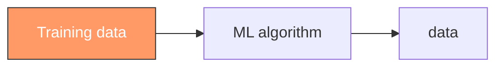
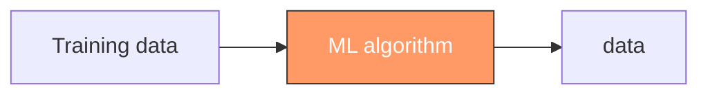
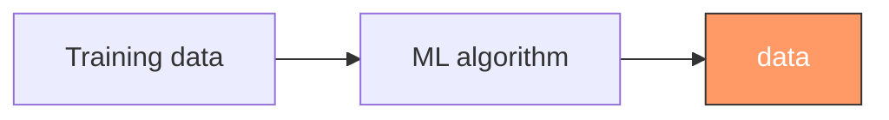

<!-- vim-markdown-toc GFM -->

* [Abstract](#abstract)
* [Machine Learning Fundamentals](#machine-learning-fundamentals)
  * [Training data](#training-data)
  * [Machine learning process](#machine-learning-process)
  * [Inferencing (推理)](#inferencing-推理)
* [Deep Learning Fundamentals](#deep-learning-fundamentals)
  * [Neural networks (ニューラルネットワーク / 神经网络)](#neural-networks-ニューラルネットワーク--神经网络)
* [Generative AI Fundamentals](#generative-ai-fundamentals)
  * [Foundation models](#foundation-models)
    * [A few types of FMs essential to understanding](#a-few-types-of-fms-essential-to-understanding)
  * [Optimizing model outputs](#optimizing-model-outputs)
* [AWS Infrastructure and Technologies](#aws-infrastructure-and-technologies)
  * [AWS AI/ML services stack](#aws-aiml-services-stack)
    * [Transcript: AWS AI/ML services](#transcript-aws-aiml-services)
  * [Advantages and benefits of AWS AI solutions](#advantages-and-benefits-of-aws-ai-solutions)
  * [Cost considerations](#cost-considerations)
* [Reference](#reference)

<!-- vim-markdown-toc -->

## Abstract
AI is a broad field that encompasses the development of intelligent systems capable of performing tasks that typically require human intelligence, such as perception, reasoning, learning, problem-solving, and decision-making.
- perception : 感知
- reasoning : 推理
- problem-solving : 解决问题
- decision-making : 决策

ML is a type of AI for understanding and building methods that make it possible for machines to learn. 

Deep learning uses the concept of neurons and synapses similar to how our brain is wired. 

Generative AI is a subset of deep learning because it can adapt models built using deep learning, but without retraining or fine tuning.

AI ⊃ ML ⊃ DL ⊃ Gen-AI

## Machine Learning Fundamentals

Building a ML modele involves
- data collection
- prepartion
- selecting an appropriate algorithm
- training data

### Training data

An ML model is only as good as the data used to train it.

- Labeled data (带标签数据）  
  Labeled data is a dataset where each instance or example is accompanied by a label or target variable that represents the desired output or classification. 
- Unlabeled data (未标记数据)  
  Unlabeled data is a dataset where the instances or examples do not have any associated labels or target variables.
- Structured data (结构化数据)  
  Structured data refers to data that is organized and formatted in a predefined manner, typically in the form of tables or databases with rows and columns.   
  - Tabular data (表格数据）
  - Time-series data (时间序列数据）
- Unstructured data (非结构化数据)  
  Unstructred data is data that lacks a predefined structure or format, such as text, images, audio, and video.
  - Text data
  - Image data

### Machine learning process

The ML process is divided into three broad categories:
- supervised learning (监督学习)
- unsupervised learning (无监督学习)  
  The goal is to discover inherent(固有的) patterns, structures, or relationships within the input data.
- reinforcement learning (强化学习)  
  In reinforcement learning, the machine is given only a performance score as guidance and semi-supervised learning, where only a portion of training data is labeled. Feedback is provided in the form of rewards or penalties for its actions, and the machine learns from this feedback to improve its decision-making over time.

### Inferencing (推理)

two types:
- batch inferencing  
  Batch inferencing is when the computer takes a large amount of data, such as images or text, and analyzes it all at once to provide a set of results. 
- real-time inferencing  
  Real-time inferencing is when the computer has to make decisions quickly, in response to new information as it comes in.

## Deep Learning Fundamentals
The field of deep learning is inspired by the struture and function of the brain.

### Neural networks (ニューラルネットワーク / 神经网络)

A couple branches of AI where deep learning is used:
- Computer vision (计算机视觉)
- Natural language processing (NLP / 自然语言处理）

## Generative AI Fundamentals
Contributors to the rise of generative AI:
- huge investments in resources
- hiring a large team
- spending on compute resources
- having the willingness to invest and develop big ideas

### Foundation models

- Foundation models (FMs) are those pretrained on internet-scale data.
- With FMs, you can adapt a single FM to perform multiple tasks.
- FM lifecycle (several stages)
  - Data selection
  - Pre-training (预训练)
    - FMs are typically pre-trained through self-supervised learning
    - After the initial pre-training, the model can be further pre-trained on additional data. This is known as continuous pre-training.
    - Optimization  
      Pre-trained language models can be optimized through techniques like prompt engineering, retrieval-augmented generation (RAG / 检索增强生成), and fine-tuning on task-specific data.
    - Evaluation
    - Deployment
    - Feedback and continuous improvement
      - After deployment, the model's performance is continuously monitored, and feedback is collected from users, domain experts, or other stakeholders.
      - This feedback, along with model monitoring data, is used to identify areas for improvement, detect potential biases or drift, and inform future iterations of the model. 

#### A few types of FMs essential to understanding
- Large language models (LLMs)
  - transformer architecture : the most common architecture
  - TOKENS
    - Tokens are the basic units of text that the model processes.
    - Tokens can be words, phrases, or individual characters like a period.
    - The sentence "A puppy is to dog as a kitten is to cat." might be broken up into the following tokens: “A” “puppy” “is” “to” “dog” “as” "a" “kitten” “is” “to” "cat."

      

  - EMBEDDINGS AND VECTORS (嵌入与向量)
    - Embeddings are numerical representations of tokens, where each token is assigned a vector (a list of numbers) that captures its meaning and relationships with other tokens.
    - For example, the embedding vector for the token "cat" might be close to the vectors for "feline" and "kitten" in the embedding space, indicating that they are semantically related.
    - This way, the model can understand that "cat" is similar to "feline" and "kitten" without being explicitly programmed with those relationships.

      

- Diffusion models (扩散模型/拡散モデル)  
  扩散模型的核心思想是：
  >先把“有结构的数据”一步步加噪声变成“纯噪声”，再学习如何一步步把噪声“还原”成有结构的数据。

  - Diffusion is a deep learning architecture system that starts with pure noise or random data.
  - The models gradually add more and more meaningful information to this noise until they end up with a clear and coherent output, like an image or a piece of text.
  - Two steps
    - Forward diffusion (正向过程：加噪声)  
      Using forward diffusion, the system gradually introduces a small amount of noise to an input image until only the noise is left over.
    - Reverse diffusion (反向过程：去噪)  
      In the subsequent reverse diffusion step, the noisy image is gradually introduced to denoising until a new image is generated.
  - Diffusion models can be applied to a variety of tasks beyond just image generation.

- Multimodal models (多模态模型)  
  多模态模型是能够同时理解和生成多种模态数据（如文本、图像、语音、视频等），并在它们之间建立语义对应关系的模型。

  Multimodal models can process and generate multiple modes of data simultaneously.

  Multimodal models can be used for automating video captioning, creating graphics from text instructions, answering questions more intelligently by combining text and visual info, and even translating content while keeping relevant visuals.

- Other generative models
  - Generative Adversarial Networks (对抗生成网络)
    - GANs 的核心思想
      >一个模型负责“造假”（生成器），另一个模型负责“打假”（判别器），两者在对抗中一起变强
    - GANs are a type of generative model that involves two neural networks competing against each other in a zero-sum game framework. The two networks are generator and discriminator.
    - **Generator**: This network generates new synthetic data (for example, images, text, or audio) by taking random noise as input and transforming it into data that resembles the training data distribution.

    - **Discriminator**: This network takes real data from the training set and synthetic data generated by the generator as input. Its goal is to distinguish between the real and generated data.

    

    ref:https://www.researchgate.net/figure/Typical-Generative-Adversarial-Networks-GAN-architecture_fig2_349182009

  - Variational autoenvoders (VAEs/变分自编码器/変分自己符号化器)
    - VAEs的核心思想家
      >不把数据压缩成一个“确定点”，而是压缩成一个“概率分布”，从这个分布中采样就能生成新数据。
    - VAEs are a type of generative model that combines ideas from autoencoders (a type of neural network) and variational inference (a technique from Bayesian statistics/贝叶斯统计). 
    - **Encoder**: This neural network takes the input data (for example, an image) and maps it to a lower-dimensional latent space, which captures the essential features of the data.
      - latent space: 潜空间
      - essential features: 基本特征
    - **Decoder**: This neural network takes the latent representation from the encoder and generates a reconstruction of the original input data.

    

    ref:[Variational Autoencoder in TensorFlow](https://learnopencv.com/variational-autoencoder-in-tensorflow/?utm_source=chatgpt.com)

    The key aspect of VAEs is that the latent space is encouraged to follow a specific probability distribution (usually a Gaussian distribution/高斯分布), which allows for generating new data by sampling from this latent space and passing the samples through the decoder.

### Optimizing model outputs
These techniques vary in complexity and cost, with the fastest and lowest cost option being prompt engineering.

- prompt engineering: 快速工程/プロンプトエンジニアリング
- prompts: 提示信息  
  Act as instructions for foundation models. Prompt engineering focuses on developing, designing, and optimizing prompts to enhance the output of FMs for your needs. It gives you a way to guide the model's behavior to the outcomes that you want to achieve.
  - **Instructions**: A task for the FM to do.
  - **Context**: An external information to guide the model.
  - **Input data**: The input for which you want a response.
  - **Output indicator**: The output type or format.

- Fine-tuning (微调/ファインチューニング)  
  在一个已经预训练好的模型基础上，用较少的任务/领域数据，对模型参数进行再训练，使其适配特定任务。

  Fine-tuning is a supervised learning process that involves taking a pre-trained model and adding specific, smaller datasets. Adding these narrower datasets modifies the weights of the data to better align with the task.

  - Two ways to fine-tune a model
    - **Instruction fine-tuning** use example of how the model should respond to a specific instruction.
    - **Reinforcement learning from human feedback (RLHF)** provides human feedback data, resulting in a model that is better aligned with human preferences.

  Fine-tuning 是把“通用模型”塑造成“专用工具”的过程，核心不在于训练多久，而在于“改哪些参数、用什么数据”

- Retrieval-augmented generation (RAG/检索增强生成)
  - RAG 是一种架构：在生成回答之前，先从外部知识库中“检索”相关信息，再让大模型基于这些信息进行生成。
  - 把“记忆”放在模型外，把“思考和表达”放在模型内。
  - A technique that supplies domain-relevant data as context to produce responses based on that data.
  - This technique is similar to fine-tuning. However, rather than having to fine-tune an FM with a small set of labeled examples, RAG retrieves a small set of relevant documents and uses that to provide context to answer the user prompt. 

  - RAG的核心流程(Pipeline)
    - 离线阶段(Indexing)
      - 文档切分(chunking)
      - 向量化(embedding)
      - 简历索引(向量数据库)
    - 在线阶段(Query-time)
      - 用户问题→向量化
      - 相似度检索(Top-k)
      - 构造Prompt(上下文注入)
      - LLM生成回答

## AWS Infrastructure and Technologies
### AWS AI/ML services stack
#### Transcript: AWS AI/ML services
- ML Infrastructure & Frameworks
  | Service | Summary | Key Features |
  | :--- | :--- | :--- |
  | **Amazon SageMaker** | Fully managed ML service | Tools and infrastructure to build, train, and deploy custom models; accelerates the ML lifecycle. |

- Specialized AI/ML Services  
  Tailored for specific domains and use cases, ready to be integrated into applications.

  | Domain | Service | Key Functionality |
  | :--- | :--- | :--- |
  | **Text & Documents** | **Amazon Comprehend** | Natural language processing (NLP). |
  | | **Amazon Translate** | Language translation. |
  | | **Amazon Textract** | Data extraction from scanned documents. |
  | **Chatbots** | **Amazon Lex** | Conversational interfaces (powered by Alexa technology). |
  | **Speech** | **Amazon Polly** | Text-to-speech conversion. |
  | | **Amazon Transcribe** | Automatic speech recognition. |
  | **Vision** | **Amazon Rekognition** | Deep learning-based image and video analysis. |
  | **Search** | **Amazon Kendra** | Enterprise search for websites and applications. |
  | **Recommendations** | **Amazon Personalize** | Real-time personalization and recommendations. |
  | **Miscellaneous** | **AWS DeepRacer** | Hands-on reinforcement learning with autonomous cars. |

- Generative AI Layer  
  Services and tools that unlock the power of Foundation Models (FMs).

  | Service | Summary | Key Features |
  | :--- | :--- | :--- |
  | **Amazon Bedrock** | Fully managed service for FMs | Access FMs from Amazon and startups via API; private customization with your data. |
  | **PartyRock** | Bedrock Playground | An Amazon Bedrock Playground for building AI applications hands-on. |
  | **SageMaker JumpStart** | Solution & Model Hub | Provides pre-built solutions for common generative AI use cases. |
  | **Amazon Q** | Generative AI Assistant | AI-powered assistant for work, tailored to business data. |
  | **Amazon Q Developer** | AI Coding Assistant | ML-powered code recommendations to accelerate development. |

### Advantages and benefits of AWS AI solutions
- Accelerated development and deployment
- Scalability and cost optimization
- Flexibility and access to models
- Integration with AWS tools and services

### Cost considerations
- Responsiveness and availability
  - AWS generative AI services are designed to be highly responsive and available.
  - However, higher levels of responsiveness and availability often come at an increased cost.
- Redundancy and Regional coverage
  - AWS generative AI services can be deployed across multiple Availability Zones or even across multiple AWS Regions. 
- Performance
  - AWS offers different compute options (for example, CPU, GPU, and custom hardware accelerators) for generative AI services.
- Token-based pricing
  - Many AWS generative AI services use a token-based pricing model.
- Provisioned throughput
  - Some AWS generative AI services let you provision a specific amount of throughput in advance.
- Custom models
  - You can also bring your own custom models or fine-tune existing models.

## Reference
- [Fundamentals of Machine Learning and Artificial Intelligence](https://www.coursera.org/learn/fundamentals-of-machine-learning-and-artificial-intelligence)  
  This studying note is based on this article.
